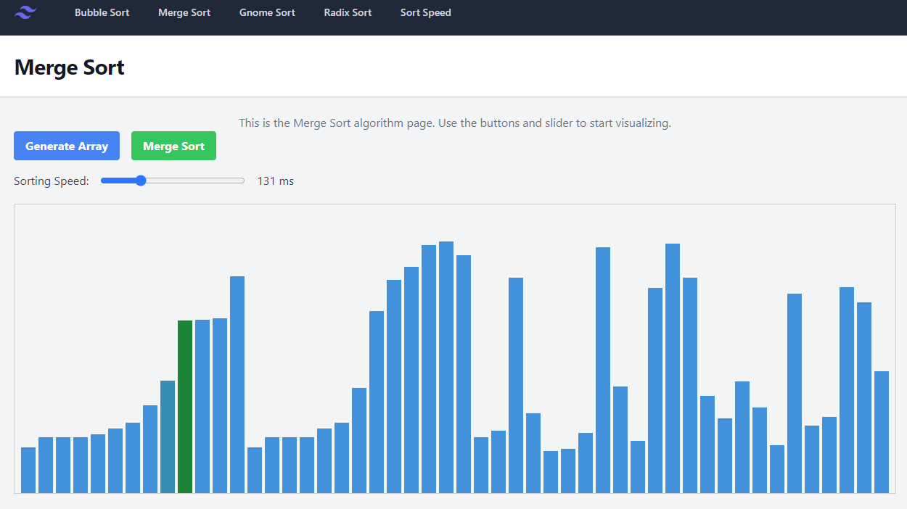
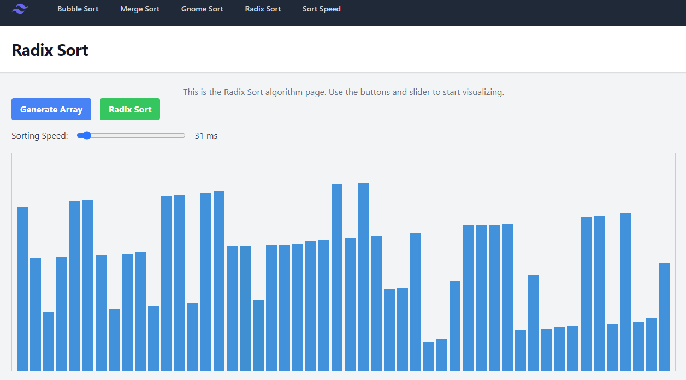

# DSA: en interaktiv, visuel implementering af sorteringsalgoritmer

## udarbejdet af:
Jacob Tobias Kristensen

## beskrivelse:
Dette er en visualisering af forskellige sorteringsalgoritmer i et interaktivt format. Det er muligt at generere tilfældige arrays og justere hastigheden af visualiseringen ved hjælp af en slider. Der er anvendt Vue some framework og TailwindCSS til styling.

### Gnome sort 
algoritmen flytter elementer til deres korrekte placering ved hjælp af en række swaps, lidt ligesom en havenisse der sorterer havekrukker efter størrelse en ad gangen. 
Ved hver sammenligning farves de elementer, der evalueres, med farven grøn. Når algoritmen har sorteret listen, vil det færdige array blive vist i blåt.

### Bubble sort
er en simpel sammenligningsalgoritme, der gentagende gange går gennem listen, sammenligner tilstødende elementer og bytter dem, hvis de er i forkert rækkefølge.
De elementer der sammenlignes, bliver visualiseret med farven grøn. Når algoritmen har sorteret listen, vil det færdige array blive vist i blåt.

### Radix sort
er en ikke-sammenligningsbaseret algoritme der sorterer tallene ved at kigge på de individuelle cifre. Først kigger algoritmen på det sidste ciffer i hvert tal (enere, så tiere, hundreder osv.) Den gruppere numrene baseret på dette ciffer. For eksempel alle numre der ender på 0 i én gruppe, alle der ender på 1 i en anden gruppe osv.
Efter grupperingen lægges grupperne sammen i rækkefølge. 
Denne proces gentages for det næste ciffer(tiere, hundreder osv.) indtil alle cifre er sorteret. Det ser således ud:

### Merge sort
Merge sort er en “divide-and-conquer” algoritme. Den deler listen op i mindre dele, sorterer
hver del for sig, og samler dem derefter igen i den rigtige rækkefølge.
Først deles listen gentagne gange i to halvdele, indtil vi har lister, der kun består af ét
element. Et enkelt element betragtes som sorteret, da der ikke er noget at sammenligne det
med. Når vi har delt listen ned til individuelle elementer, begynder vi at samle og sortere
disse små lister. Vi tager to nærliggende elementer og sammenligner dem, og samler dem i
en ny sorteret liste. Denne proces gentages, indtil alle elementer er samlet i en sorteret
rækkefølge

### Sådan kører du det lokalt:

- Klon dette repository
- Åbn mappen i dit foretrukne IDE
- Installer dependencies ved at køre `npm install`
- Start server ved at køre `npm run dev`
- Åbn din browser og gå til den URL, der vises i terminalen (typisk http://localhost:5173)
- Følg anvisningerne på skærmen

## this code is live at:
https://sorting-algorithms-sigma.vercel.app/
